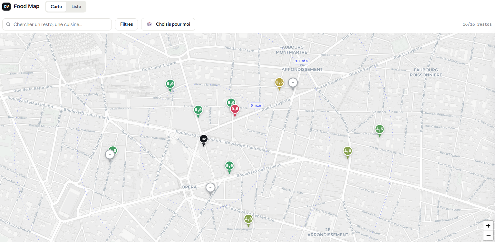

# DV Food Map

An internal map of lunch spots around the Digital Value office (rue de la
Chaussée d'Antin, Paris). Team members add restaurants, rate them, and leave
comments. The map shows walking time from the office, filters by rating,
price, cuisine or tags, and can pick a restaurant at random when nobody wants
to decide.

**[Public demo](https://fabien-sartre.github.io/dvfoodmap_v2/?demo=1)** is
read-only and serves real data with all personal information stripped. The
full app requires a `@digitalvalue.fr` account.



## Repository layout

```
index.html                  all markup (login screen, app shell, map and list
                            views, detail panel, modals)
styles.css                  the design, tokens (colors, type, radii) in :root
app.js                      all logic (auth, data loading, Leaflet map,
                            filters, hash routing, demo mode)
config.js                   deployment config (Supabase URL and anon key,
                            office coordinates, tags, price ranges,
                            walking-speed constants)
demo-data.js                committed data snapshot that powers demo mode
supabase/
  01_schema.sql             tables (profiles, restaurants, reviews), the
                            profile-creation trigger, the stats view
  02_rls.sql                Row Level Security policies (the security model)
  03_admin.sql              admins table and is_admin() RPC
  04_tags.sql               migration adding the tags column
  05_geofence.sql           CHECK constraint limiting entries to the Paris area
  export_demo_data.sql      read-only query that regenerates demo-data.js
```

There is no build step. The frontend is four hand-written files plus two CDN
scripts (Leaflet 1.9.4, supabase-js v2 UMD). Deploying is `git push`; GitHub
Pages serves the `main` branch as-is.

## Infrastructure

| Component | Choice | Cost |
|---|---|---|
| Hosting | GitHub Pages, public repo | $0 |
| Database, auth, API | Supabase free tier (Postgres + GoTrue + PostgREST) | $0 |
| Confirmation emails | Brevo SMTP, free tier | $0 |
| Map tiles | Leaflet + CARTO | $0 |
| Geocoding | Nominatim (OpenStreetMap), no API key | $0 |

The browser talks to Supabase's auto-generated REST API directly; there is no
application server. GitHub Pages' free tier requires the repo to be public, so
everything in it has to be publishable.

### Data model

Three tables and a view, defined in `supabase/01_schema.sql`.

- `profiles` holds display names, filled at signup by a trigger from the
  email local part (`prenom.nom@…` becomes "Prenom Nom"). The table exists
  because `auth.users` is not reachable from the browser.
- `restaurants` holds name, address, coordinates, cuisine, price range and
  tags. A unique constraint on `(name, address)` catches duplicate entries,
  and a CHECK constraint keeps coordinates inside the Paris region.
- `reviews` holds a rating in half-star steps (CHECK constraint) and an
  optional comment, with one row per user and restaurant. The client upserts
  against that unique constraint.
- `restaurants_with_stats` is a view computing average rating and review
  count at query time, which keeps them in sync with the reviews table by
  construction.

### Security model

This is Supabase's standard architecture. The `anon` key in `config.js` is
public by design, and all access control happens in Postgres Row Level
Security. The design is conventional; the work is in the policies
([`supabase/02_rls.sql`](supabase/02_rls.sql)), because with a fully public
client any policy mistake is directly exposed.

The policies enforce the following.

- **Reads and writes require a confirmed company account.** A
  `is_company_user()` SQL function checks that the current user's email is on
  `@digitalvalue.fr` and has been confirmed by clicking the signup link. An
  anonymous visitor holding the anon key gets zero rows back.

- **Writes are bound to their author.** Insert policies require
  `user_id = auth.uid()`, and update/delete policies only match your own
  rows.

- **The domain rule holds even if the Auth configuration is wrong.** A
  `before insert` trigger on `auth.users` rejects any signup outside the
  domain at the database level, independently of the dashboard's signup
  settings.

- **The `admins` table is unreachable through the API.** It has RLS enabled
  and zero policies, so admin status can only be granted, or even read, from
  the dashboard's SQL editor.

- **Aggregates go through a `security_invoker` view.** By default a Postgres
  view executes with its owner's privileges and bypasses RLS on the tables
  underneath; `security_invoker = true` makes it run with the querying user's
  rights instead.

Before the app was shared with the team, the policies were tested from the
outside. Anonymous reads return nothing, an off-domain signup is rejected by
the trigger, and a second test account could neither edit nor delete the first
account's review.

### Auth and email delivery

Supabase Auth handles email + password with mandatory confirmation. The
built-in email sender is rate-limited to a few messages per hour, so
confirmation emails go through Brevo's free SMTP relay instead (a wrong SMTP
port shows up as 504 timeouts at signup rather than an error message). The app
passes `emailRedirectTo` on every auth call, so confirmation links return to
whatever origin the user signed up from (production or localhost) without
depending on the dashboard's site URL.

### Frontend notes

`app.js` is a single IIFE, no framework.

- Routing is hash-based (`#carte`, `#liste`, `#resto=<id>` for deep links to
  a restaurant card), so the static host needs no rewrite rules.
- All user content goes through an `esc()` helper before DOM insertion.
- Walking time is computed in the browser as haversine distance from the
  office, times a 1.3 detour factor, divided by an 80 m/min walking speed,
  a decent approximation for central Paris streets. Office coordinates live
  in `config.js`, so moving the office is a one-line change and the
  5/10/15-minute rings follow.
- Adding a restaurant geocodes the address in the browser via Nominatim, one
  request per click. Only the resulting coordinates are saved. Directions are
  a Google Maps deep link, no API involved.

### Demo mode

`?demo=1` runs the app from `demo-data.js`, a committed snapshot generated by
[`supabase/export_demo_data.sql`](supabase/export_demo_data.sql). The snapshot
contains restaurants and aggregate ratings, with author IDs and review
comments excluded. In this mode the Supabase client is not instantiated, so
the page makes zero API requests; write actions are hidden and individual
reviews show a placeholder note. This is what the public demo link above
serves.

## Running locally

```bash
python -m http.server 8000
# http://localhost:8000/?demo=1  -> demo mode, no backend needed
# http://localhost:8000          -> full app (@digitalvalue.fr account)
```

## Reusing this

The SQL files in `supabase/` are commented and replayable in order on a fresh
project, and all deployment-specific values live in `config.js`. A
step-by-step replication guide (Supabase setup, SMTP, security testing) is in
[`CLAUDE.md`](CLAUDE.md).
